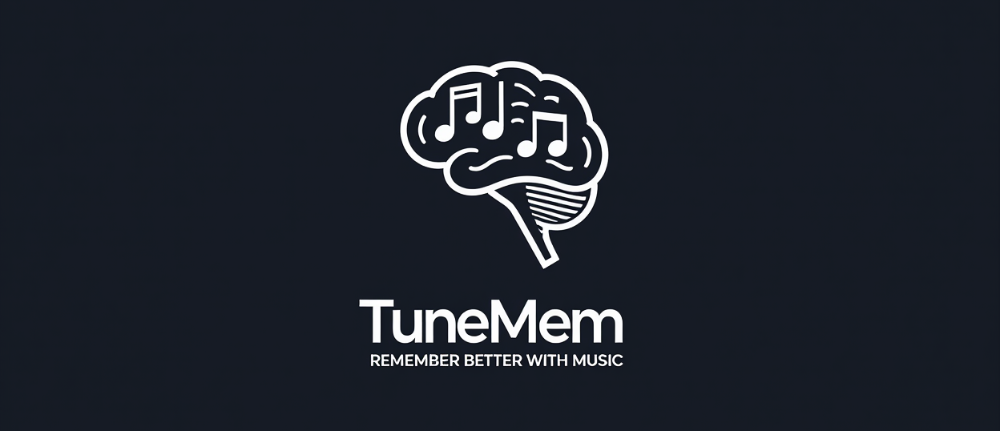

# TuneMem: Remember Better with Music



TuneMem is an innovative app designed to help users memorize information by converting it into catchy songs or jingles. Leveraging the power of music to enhance memory retention, this app transforms text into memorable tunes, making learning and recalling facts easier and more enjoyable. Whether you're studying for exams, preparing for presentations, or simply trying to remember daily tasks, TuneMem makes memorization fun and effective.

## 🌍 Available Languages

- [English](README.md) (Default)
- [Türkçe](README.tr.md) (Turkish)
- [Deutsch](README.de.md) (German)
- [Français](README.fr.md) (French)

## Why Music?

Research shows that music can significantly enhance memory retention. By associating information with melodies, TuneMem leverages auditory learning to make memorization more effective and enjoyable. Studies from [Harvard Health](https://www.health.harvard.edu/mind-and-mood/music-can-boost-memory-and-mood) and other sources support the use of music in memory enhancement.

## Key Features

### **Core Learning Features**
- **Text to Tune Conversion**: Input any text, and the app generates a unique melody to help you remember it
- **Advanced Music Algorithms**: Sophisticated scales, chord progressions, and musical theory for rich compositions
- **AI-Powered Melody Generation**: Machine learning patterns with sentiment analysis for optimal tune creation
- **Multiple Music Styles**: Pop, classical, jazz, rock, blues, and more with customizable parameters
- **Practice Modes**: Melody recognition and content recall exercises with scoring and feedback
- **Difficulty Levels**: Beginner, intermediate, and advanced options for all skill levels

### **Advanced Analytics & Insights**
- **Comprehensive Progress Tracking**: Monitor your memory improvement with detailed statistics and analytics
- **Advanced Analytics Dashboard**: Interactive charts, learning trends, and performance metrics
- **AI Study Recommendations**: Personalized learning suggestions powered by intelligent analysis
- **Spaced Repetition**: Intelligent review scheduling based on forgetting curves
- **Learning Streaks**: Motivation through consistent practice tracking and achievements
- **Style & Difficulty Analysis**: Detailed breakdown of learning patterns and preferences

### **Search & Organization**
- **Advanced Search & Filters**: Multi-criteria search across titles, content, and tags
- **Smart Filtering**: Style, difficulty, tags, practice count, and date ranges
- **Real-time Results**: Instant filtering as you type with multiple sort options
- **Tag Management**: Organize tunes with custom tags and categories
- **Collapsible Interface**: Expandable advanced filter panel for power users

### **Social & Collaboration**
- **Multi-Platform Sharing**: Share tunes on Twitter, Facebook, LinkedIn, WhatsApp, and Email
- **Collaboration Features**: Invite users, manage permissions, and track collaborative projects
- **Social Analytics**: Monitor likes, comments, shares, and engagement metrics
- **QR Code Generation**: Easy sharing with visual codes for offline distribution
- **Social Media Previews**: Rich metadata for better social media sharing

### **Learning Platform Integration**
- **7 Major LMS Platforms**: Canvas, Blackboard, Moodle, Google Classroom, Khan Academy, Coursera, edX
- **Course Management**: Create courses from tunes and manage assignments
- **Data Synchronization**: Import/export tunes between platforms seamlessly
- **Learning Analytics**: Track progress across multiple platforms and institutions
- **Assignment Tracking**: Monitor completion and performance across courses

### **Advanced Tools & Visualization**
- **Music Visualizer**: Real-time audio visualization with waveform and spectrum analysis
- **Interactive Demos**: Live previews of all advanced features and tools
- **Tools Page**: Comprehensive showcase organized by category (Music, AI, Productivity, Social, Learning)
- **Status Indicators**: Clear visibility of feature availability (Available, Beta, Coming Soon)
- **Feature Lists**: Detailed breakdown of each tool's capabilities and use cases

### **Offline & Mobile Support**
- **Progressive Web App**: Full offline functionality with service worker support
- **Offline Caching**: Store tunes locally for offline access and practice
- **Background Sync**: Automatic synchronization when online connection is restored
- **Data Persistence**: IndexedDB and localStorage for reliable data storage
- **Mobile-First Design**: Optimized for touch devices and responsive layouts

### **Web Platform Features**
- **Modern Web Technologies**: Built with React 18, TypeScript, and modern web standards
- **Responsive Design**: Works seamlessly on desktop, tablet, and mobile browsers
- **Progressive Enhancement**: Core functionality works everywhere, enhanced features where supported
- **Accessibility**: Keyboard navigation, screen reader support, and high contrast modes

## 🚀 What's New in v2.0

TuneMem v2.0 introduces groundbreaking features that transform it from a simple text-to-melody app into a comprehensive learning platform:

- **🎵 Advanced Music Engine**: Sophisticated algorithms, AI-powered generation, and real-time visualization
- **🤖 AI Learning Intelligence**: Personalized recommendations, spaced repetition, and adaptive difficulty
- **📊 Advanced Analytics**: Interactive dashboards, trend analysis, and performance insights
- **🔍 Smart Search & Organization**: Multi-criteria filtering, real-time search, and intelligent sorting
- **🌐 Social & Collaboration**: Multi-platform sharing, collaboration tools, and social analytics
- **🎓 Learning Platform Integration**: Connect with 7 major LMS platforms for seamless learning
- **📱 Progressive Web App**: Full offline support, mobile optimization, and cross-device sync
- **🌙 Dark Theme System**: Beautiful themes with system preference detection
- **🛠️ Advanced Tools Suite**: Comprehensive showcase of all features with interactive demos

## Tech Stack

- **Frontend**: React 18 + TypeScript
- **Styling**: Tailwind CSS + Framer Motion
- **State Management**: Zustand with persistence
- **Form Handling**: React Hook Form + Zod validation
- **Audio**: Tone.js for music generation and playback
- **Web Audio API**: Real-time audio visualization and analysis
- **Build Tool**: Vite
- **Testing**: Vitest
- **Linting**: ESLint + TypeScript ESLint
- **Theme System**: CSS custom properties with dark mode support
- **Progressive Web App**: Service Worker + IndexedDB
- **Social Integration**: Multi-platform sharing APIs
- **Learning Platforms**: LMS integration services

## Installation

### Prerequisites

- Node.js 16.0.0 or higher
- npm 8.0.0 or higher

### Setup

1. **Clone the repository**
   ```bash
   git clone https://github.com/makalin/TuneMem.git
   cd TuneMem
   ```

2. **Install dependencies**
   ```bash
   npm install
   ```

3. **Start development server**
   ```bash
   npm run dev
   ```

4. **Open your browser**
   Navigate to [http://localhost:3000](http://localhost:3000)

## Available Scripts

- `npm run dev` - Start development server
- `npm run build` - Build for production
- `npm run preview` - Preview production build
- `npm run lint` - Run ESLint
- `npm run lint:fix` - Fix ESLint issues
- `npm run test` - Run tests
- `npm run test:ui` - Run tests with UI
- `npm run test:coverage` - Run tests with coverage
- `npm run type-check` - Check TypeScript types

## Project Structure

```
TuneMem/
├── src/
│   ├── components/          # Reusable UI components
│   │   ├── Layout.tsx      # Main layout wrapper
│   │   ├── Header.tsx      # Application header
│   │   ├── Sidebar.tsx     # Navigation sidebar
│   │   ├── TuneCard.tsx    # Individual tune display
│   │   ├── ThemeToggle.tsx # Dark/light theme switcher
│   │   ├── MusicVisualizer.tsx # Real-time audio visualization
│   │   ├── AnalyticsDashboard.tsx # Comprehensive analytics
│   │   ├── AdvancedSearch.tsx # Advanced search & filters
│   │   └── AIStudyRecommendations.tsx # AI-powered recommendations
│   ├── pages/              # Page components
│   │   ├── Home.tsx        # Dashboard/home page
│   │   ├── Create.tsx      # Create new tunes
│   │   ├── Practice.tsx    # Practice and testing
│   │   ├── Progress.tsx    # Progress tracking with analytics
│   │   ├── Tools.tsx       # Advanced tools showcase
│   │   └── NotFound.tsx    # 404 page
│   ├── stores/             # State management
│   │   └── tuneStore.ts    # Zustand store for tunes
│   ├── services/           # Business logic
│   │   ├── musicService.ts # Basic music generation and playback
│   │   ├── advancedMusicService.ts # Advanced music algorithms
│   │   ├── aiMelodyService.ts # AI-powered melody generation
│   │   ├── socialSharingService.ts # Social sharing & collaboration
│   │   ├── learningPlatformService.ts # LMS integration
│   │   └── offlineService.ts # Offline support & sync
│   ├── contexts/           # React contexts
│   │   └── ThemeContext.tsx # Theme management context
│   ├── hooks/              # Custom React hooks
│   │   └── useDarkMode.ts  # Dark mode hook
│   ├── types/              # TypeScript type definitions
│   │   └── index.ts        # Main type definitions
│   ├── App.tsx             # Main app component
│   ├── main.tsx            # Application entry point
│   └── index.css           # Global styles with dark theme
├── public/                 # Static assets
│   └── tunemem_logo.png   # Application logo
├── package.json            # Dependencies and scripts
├── tsconfig.json           # TypeScript configuration
├── vite.config.ts          # Vite configuration
├── tailwind.config.js      # Tailwind CSS configuration
├── postcss.config.js       # PostCSS configuration
├── .eslintrc.cjs           # ESLint configuration
└── .gitignore              # Git ignore rules
```

## Usage

### Creating a New Tune

1. Navigate to the **Create** page
2. Enter a title and the content you want to memorize
3. Choose a music style and difficulty level
4. Add relevant tags
5. Click "Generate Melody" to create a unique tune
6. Preview and play the generated melody
7. Save your tune for future practice

### Practice Mode

1. Go to the **Practice** page
2. Choose between melody recognition or content recall modes
3. Listen to the melody and test your memory
4. Track your progress and scores
5. Review correct answers and learn from mistakes

### Progress Tracking

- View comprehensive statistics and learning analytics
- Monitor patterns, track progress, and unlock achievements
- Access AI-powered study recommendations and insights

## Example Use Cases

### Memorizing the Periodic Table
- Input: "Hydrogen, Helium, Lithium, Beryllium"
- Style: Pop
- Result: A catchy pop melody that helps recall the elements

### Learning Vocabulary
- Input: "Serendipity - finding something good without looking for it"
- Style: Classical
- Result: An elegant classical piece for sophisticated vocabulary

### Remembering Tasks
- Input: "Buy milk, call dentist, submit report"
- Style: Jazz
- Result: A smooth jazz tune for daily reminders

## Application Architecture

### **Frontend Architecture**
- **Component-Based Design**: Modular, reusable components with clear separation of concerns
- **State Management**: Centralized state with Zustand for global app state
- **Context System**: React Context for theme management and global configurations
- **Custom Hooks**: Reusable logic encapsulated in custom React hooks
- **Type Safety**: Comprehensive TypeScript interfaces for all data structures

### **Service Layer**
- **Music Services**: Core music generation, advanced algorithms, and AI-powered suggestions
- **Social Services**: Sharing, collaboration, and social media integration
- **Learning Services**: LMS integration and educational platform connectivity
- **Offline Services**: Data persistence, caching, and synchronization
- **Analytics Services**: Learning analytics and performance tracking

### **Data Flow**
- **Unidirectional Data Flow**: Predictable state updates through actions
- **Persistent Storage**: Local storage with IndexedDB for offline capabilities
- **Real-time Updates**: Immediate UI updates with optimistic rendering
- **Error Boundaries**: Graceful error handling and user feedback
- **Loading States**: Smooth loading experiences with skeleton screens

## Contributing

We welcome contributions to make TuneMem even better! If you have ideas for new features, bug fixes, or want to help with development, please:

1. Fork the repository
2. Create a feature branch (`git checkout -b feature/amazing-feature`)
3. Commit your changes (`git commit -m 'Add amazing feature'`)
4. Push to the branch (`git push origin feature/amazing-feature`)
5. Open a Pull Request

### Development Guidelines

- **TypeScript Best Practices**: Use strict typing and avoid `any` types
- **Functional Components**: Use functional components with hooks for all new components
- **Error Handling**: Implement proper error boundaries and user feedback
- **Testing**: Add comprehensive tests for new features using Vitest
- **Code Style**: Follow existing code structure and ESLint rules
- **Documentation**: Update README and add JSDoc comments for new functions
- **Performance**: Consider performance implications of new features
- **Accessibility**: Ensure new features are accessible to all users
- **Responsive Design**: Test on multiple screen sizes and orientations

## Testing

Run the test suite to ensure everything works correctly:

```bash
# Run all tests
npm test

# Run tests with UI
npm run test:ui

# Run tests with coverage
npm run test:coverage
```

## Building for Production

```bash
# Build the application
npm run build

# Preview the production build
npm run preview
```

## Environment Variables

Create a `.env` file in the root directory for environment-specific configuration:

```env
VITE_APP_TITLE=TuneMem
VITE_APP_DESCRIPTION=Remember Better with Music
VITE_APP_VERSION=2.0.0
VITE_APP_ENVIRONMENT=development
```

### **Environment Configuration**
- **Development**: Hot reload, detailed logging, and development tools
- **Production**: Optimized builds, minimal logging, and performance optimizations
- **Testing**: Test-specific configurations and mock services
- **Staging**: Production-like environment for testing and validation

## Development Workflow

### **Getting Started**
1. **Clone and Setup**: Follow the installation steps above
2. **Development Server**: Run `npm run dev` for hot reload development
3. **Code Quality**: Use `npm run lint` and `npm run lint:fix` for code quality
4. **Type Checking**: Run `npm run type-check` for TypeScript validation
5. **Testing**: Use `npm run test` for unit tests and `npm run test:ui` for interactive testing

### **Development Tools**
- **Hot Reload**: Instant feedback during development
- **TypeScript**: Real-time type checking and IntelliSense
- **ESLint**: Code quality and style enforcement
- **Prettier**: Automatic code formatting
- **Git Hooks**: Pre-commit validation and formatting
- **Debug Tools**: Browser DevTools and React DevTools integration

### **Code Organization**
- **Feature-Based Structure**: Components organized by feature/domain
- **Shared Components**: Reusable UI components in `/components`
- **Page Components**: Route-specific components in `/pages`
- **Services**: Business logic and external integrations in `/services`
- **Types**: TypeScript interfaces and type definitions in `/types`
- **Hooks**: Custom React hooks in `/hooks`
- **Contexts**: React contexts for global state in `/contexts`

## Browser Support

### **Modern Browsers (Recommended)**
- **Chrome 90+**: Full feature support with optimal performance
- **Firefox 88+**: Complete functionality with Web Audio API support
- **Safari 14+**: Full feature support on macOS and iOS
- **Edge 90+**: Complete functionality with Chromium engine

### **Feature Compatibility**
- **Web Audio API**: Required for music generation and visualization
- **Service Workers**: Required for offline functionality and PWA features
- **IndexedDB**: Required for offline data storage and caching
- **CSS Grid & Flexbox**: Required for responsive layouts
- **ES2020+ Features**: Required for modern JavaScript functionality

### **Mobile Browsers**
- **iOS Safari 14+**: Full PWA support and offline functionality
- **Chrome Mobile 90+**: Complete feature support
- **Firefox Mobile 88+**: Full functionality with touch optimization
- **Samsung Internet 14+**: Complete feature support

### **Fallback Support**
- **Progressive Enhancement**: Core features work in older browsers
- **Graceful Degradation**: Advanced features gracefully disable if not supported
- **Feature Detection**: Automatic detection and fallback for unsupported features

## Performance

- **Lazy Loading**: Components load on-demand for faster initial page loads
- **Optimized Audio Processing**: Efficient Web Audio API usage with minimal memory footprint
- **Efficient State Management**: Zustand with persistence for optimal performance
- **Responsive Design**: Optimized layouts for all device sizes and orientations
- **Code Splitting**: Dynamic imports for better bundle management
- **Optimized Animations**: Hardware-accelerated animations with Framer Motion
- **Efficient Rendering**: React 18 concurrent features for smooth user interactions
- **Memory Management**: Proper cleanup of audio contexts and event listeners

## Security

- **Input Validation**: Comprehensive validation with Zod schema validation
- **XSS Protection**: Sanitized inputs and secure rendering practices
- **Secure Audio Context**: Proper handling of Web Audio API with user consent
- **No External Dependencies**: Core functionality works without external API calls
- **Data Privacy**: Local storage with user control over data
- **Secure Sharing**: Safe sharing mechanisms with configurable privacy settings
- **Offline Security**: Secure local data storage with IndexedDB
- **HTTPS Ready**: Secure communication protocols for production deployment

## Troubleshooting

### Audio Issues
- Ensure your browser supports Web Audio API
- Check that audio is not muted
- Try refreshing the page if audio context fails

### Performance Issues
- Close other tabs with audio
- Check browser console for errors
- Ensure you have sufficient memory available

### Build Issues
- Clear node_modules and reinstall: `rm -rf node_modules && npm install`
- Check Node.js version compatibility
- Verify all dependencies are properly installed

## Roadmap

### ✅ Version 2.0 - Completed
TuneMem v2.0 is now complete with all major features implemented and production-ready:

**Core Features**: Advanced music algorithms, AI-powered melody generation, real-time music visualization
**Learning Intelligence**: AI study recommendations, spaced repetition, adaptive difficulty progression
**Analytics & Insights**: Comprehensive dashboards, trend analysis, performance tracking
**Search & Organization**: Advanced filtering, real-time search, smart sorting
**Social & Collaboration**: Multi-platform sharing, collaboration tools, social analytics
**Platform Integration**: 7 major LMS platforms, course management, data synchronization
**Offline & Mobile**: Progressive Web App, offline caching, mobile optimization
**Theme System**: Dark/light themes with system preference detection
**Tools Suite**: Comprehensive feature showcase with interactive demos

### 🚀 Version 2.1 - In Development
**Mobile Apps**: Native iOS and Android applications
**Multi-language**: Internationalization for global users
**Advanced Collaboration**: Real-time collaborative editing and practice sessions
**Enhanced AI**: Machine learning training and improved recommendations
**Advanced Audio**: Professional-grade effects and voice recognition
**Gamification**: Achievement systems, leaderboards, and community features
**Predictive Analytics**: AI-powered learning forecasting and insights
**Third-party Integration**: Spotify, Apple Music, and other music services
**Enhanced Security**: End-to-end encryption and advanced privacy features
**Accessibility**: Screen reader support and advanced navigation options


## License

This project is licensed under the MIT License - see the [LICENSE](LICENSE) file for details.

## Contact

For any inquiries, please contact [makalin](https://github.com/makalin).

## Acknowledgments

- [Tone.js](https://tonejs.github.io/) for audio synthesis
- [Framer Motion](https://www.framer.com/motion/) for animations
- [Tailwind CSS](https://tailwindcss.com/) for styling
- [React](https://reactjs.org/) for the UI framework
- [Zustand](https://github.com/pmndrs/zustand) for state management

---

**Happy Learning with Music! 🎵✨**
